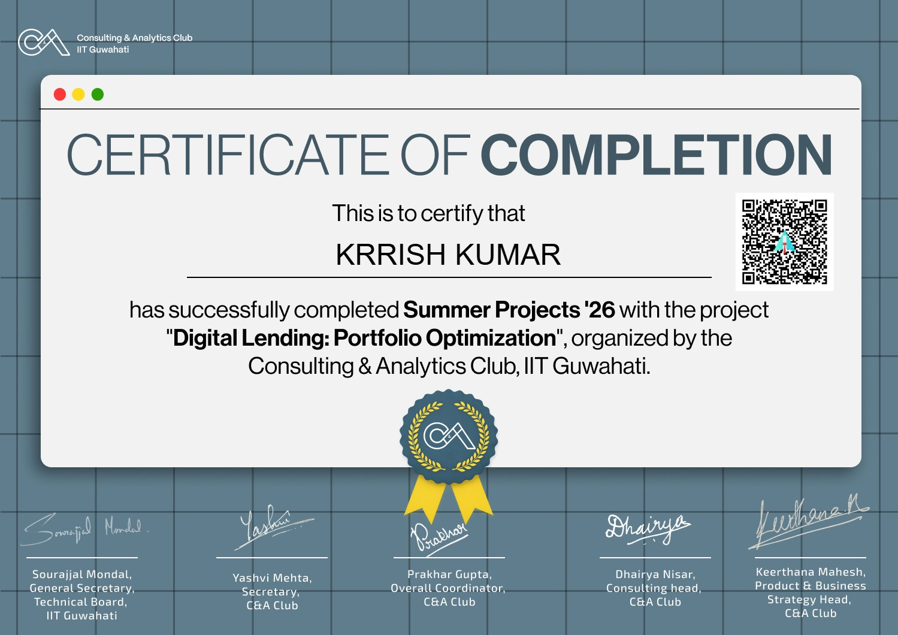

# 📊 Digital Lending Portfolio Optimization & Credit Risk Modeling

**Author:** Krishna Vijay Kunwar  
**Context:** Developed as part of the Summer Analytics 2026 program (Consulting & Analytics Club, IIT Guwahati)

## 📌 Executive Summary
This project provides an end-to-end credit risk and portfolio optimization pipeline for a digital lending business. Using a custom-built 35,000-loan synthetic dataset that reflects the realistic risk dynamics of an emerging-market lending book, this repository demonstrates how to bridge the gap between machine learning metrics (ROC-AUC) and executive business decisions (₹ Impact). 

The final deliverable includes a behavioral customer segmentation, a calibrated CatBoost early-warning model, and a simulated financial impact assessment proving that a manual-review deployment strategy generates an estimated **₹50.1M net benefit** over a naive auto-decline strategy.

## 🚀 Why This Project Stands Out (For Recruiters & Hiring Managers)
Unlike standard classification projects, this repository tackles real-world credit risk challenges:
*   **Business-Aligned Thresholding:** Optimized the decision boundary using an **F2 score** to heavily penalize false negatives (missed defaults), aligning the math with the Chief Risk Officer's actual priorities.
*   **Probability Calibration Fix:** Identified calibration drift caused by `scale_pos_weight` and successfully corrected it using **Isotonic Regression** on a held-out validation set, ensuring predicted probabilities can be safely used for risk-based pricing.
*   **Financial Impact Simulation:** Translated confusion matrix outcomes into absolute monetary value (₹), comparing avoided losses against foregone interest income to recommend a profitable deployment strategy.
*   **Model Explainability:** Utilized **SHAP** to validate that the model learned genuine causal relationships (e.g., partial payment ratios driving default risk) rather than exploiting noise.

## 🛠️ Tech Stack & Methodology
*   **Languages & Libraries:** Python, Pandas, NumPy, Scikit-Learn, XGBoost, CatBoost, SHAP.
*   **Unsupervised Learning:** K-Means Clustering (optimized `k=4` via Silhouette Score).
*   **Supervised Learning:** Gradient Boosted Trees (XGBoost & CatBoost) for Probability of Default (PD) prediction.
*   **Model Calibration:** Isotonic Regression (`CalibratedClassifierCV`).

## 📈 Key Strategic Findings
1.  **Risk Segmentation:** Segmented borrowers into four distinct profiles. The *Overleveraged* segment comprises only 6.9% of the book but carries a 14.9% default rate (nearly 7x higher than the *Prime Stable* segment).
2.  **Adverse Selection in Acquisition:** Fast, low-friction acquisition channels (Aggregator Platforms) drive the highest volume but exhibit the lowest value-per-customer due to elevated default rates. 
3.  **Deployment Economics:** Simulating the model as an automatic approve/decline gate destroys portfolio value (estimated ₹38.6M loss) due to forfeited interest from falsely flagged good loans. Routing flagged loans to a human underwriter reverses this into a **₹50.1M net positive outcome**.

## 📂 Repository Structure
*   `digital_lending_synthetic_portfolio.csv`: The 35,000-row synthetic dataset.
*   `Digital_Lending_Risk_Model_V2 (1).ipynb`: The core Jupyter Notebook containing the data validation, K-Means segmentation, CatBoost training, Isotonic calibration, SHAP explainability, and financial simulations.
*   `Digital_Lending_CRO_Memo_V2.pdf`: A 4-page strategic business memo addressed to leadership, summarizing actionable recommendations and KPIs.

Install the required dependencies:
pip install pandas numpy scikit-learn xgboost catboost shap

Run the Jupyter Notebook Digital_Lending_Risk_Model_V2 (1).ipynb to execute the pipeline from top to bottom.
